# Heritage Housing project -Predictive-Analytics

[Live Project](https://predictive-analytics-69424e907041.herokuapp.com/)

In this project, I have developed a comprehensive Data App with a sophisticated Machine Learning User Interface (UI). This app integrates: Python packages for Machine Learning, Data Analysis, and Data Visualization, such as scikit-learn, pandas, and matplotlib; and Streamlit, a powerful tool for rapid prototyping of machine learning models and creating interactive applications. This project was undertaken as my final milestone project at Code Institute, aiming to showcase my proficiency in conducting in-depth data analysis, extracting meaningful insights, and providing data-driven recommendations.

The objective of this project is to immerse users in an environment that mirrors real-world business scenarios. It encourages a deep understanding of the purpose and methodology behind a Machine Learning system that delivers significant value to an organization. The project is designed to help users think critically about the "whys" and the "hows" of implementing machine learning solutions to solve business problems.

To achieve this, the UI and data analysis components of the app are meticulously designed to align with professional business requirements. The user interface is intuitive and interactive, allowing users to explore data sets, visualize trends, and understand the impact of different variables on outcomes. The data analysis is thorough and methodical, ensuring that the insights generated are accurate and actionable.

Throughout the project, I utilized best practices in data preprocessing, feature engineering, model selection, and evaluation. By leveraging Python's robust ecosystem of data science libraries, I was able to create a dynamic and effective tool for machine learning experimentation and deployment. The use of Streamlit allows for a seamless and interactive user experience, making it easy to iterate on models and visualize results in real-time.

## USER STORY

[Kanban board](https://github.com/users/blackcatten/projects/2/views/1) with my defined [USER STORIES](https://github.com/blackcatten/Heritage-Housing-project--Predictive-Analytics/milestone/1?closed=1) and their acceptance criteria are available here.

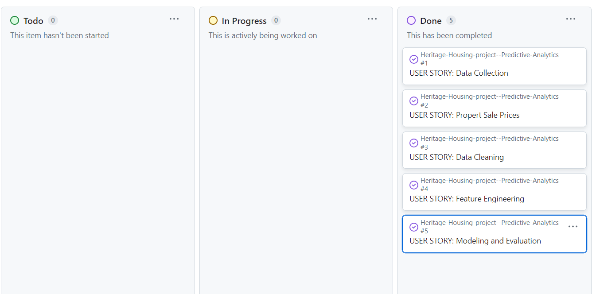

## Dataset Content

* The dataset is sourced from [Kaggle](https://www.kaggle.com/codeinstitute/housing-prices-data). We then created a fictitious user story where predictive analytics can be applied in a real project in the workplace.
* The dataset has almost 1.5 thousand rows and represents housing records from Ames, Iowa, indicating house profile (Floor Area, Basement, Garage, Kitchen, Lot, Porch, Wood Deck, Year Built) and its respective sale price for houses built between 1872 and 2010.

|Variable|Meaning|Units|
|:----|:----|:----|
|1stFlrSF|First Floor square feet|334 - 4692|
|2ndFlrSF|Second-floor square feet|0 - 2065|
|BedroomAbvGr|Bedrooms above grade (does NOT include basement bedrooms)|0 - 8|
|BsmtExposure|Refers to walkout or garden level walls|Gd: Good Exposure; Av: Average Exposure; Mn: Minimum Exposure; No: No Exposure; None: No Basement|
|BsmtFinType1|Rating of basement finished area|GLQ: Good Living Quarters; ALQ: Average Living Quarters; BLQ: Below Average Living Quarters; Rec: Average Rec Room; LwQ: Low Quality; Unf: Unfinshed; None: No Basement|
|BsmtFinSF1|Type 1 finished square feet|0 - 5644|
|BsmtUnfSF|Unfinished square feet of basement area|0 - 2336|
|TotalBsmtSF|Total square feet of basement area|0 - 6110|
|GarageArea|Size of garage in square feet|0 - 1418|
|GarageFinish|Interior finish of the garage|Fin: Finished; RFn: Rough Finished; Unf: Unfinished; None: No Garage|
|GarageYrBlt|Year garage was built|1900 - 2010|
|GrLivArea|Above grade (ground) living area square feet|334 - 5642|
|KitchenQual|Kitchen quality|Ex: Excellent; Gd: Good; TA: Typical/Average; Fa: Fair; Po: Poor|
|LotArea| Lot size in square feet|1300 - 215245|
|LotFrontage| Linear feet of street connected to property|21 - 313|
|MasVnrArea|Masonry veneer area in square feet|0 - 1600|
|EnclosedPorch|Enclosed porch area in square feet|0 - 286|
|OpenPorchSF|Open porch area in square feet|0 - 547|
|OverallCond|Rates the overall condition of the house|10: Very Excellent; 9: Excellent; 8: Very Good; 7: Good; 6: Above Average; 5: Average; 4: Below Average; 3: Fair; 2: Poor; 1: Very Poor|
|OverallQual|Rates the overall material and finish of the house|10: Very Excellent; 9: Excellent; 8: Very Good; 7: Good; 6: Above Average; 5: Average; 4: Below Average; 3: Fair; 2: Poor; 1: Very Poor|
|WoodDeckSF|Wood deck area in square feet|0 - 736|
|YearBuilt|Original construction date|1872 - 2010|
|YearRemodAdd|Remodel date (same as construction date if no remodelling or additions)|1950 - 2010|
|SalePrice|Sale Price|34900 - 755000|

## Business Requirements

As a good friend, you are requested by your friend, who has received an inheritance from a deceased great-grandfather located in Ames, Iowa, to  help in maximising the sales price for the inherited properties.

Although your friend has an excellent understanding of property prices in her own state and residential area, she fears that basing her estimates for property worth on her current knowledge might lead to inaccurate appraisals. What makes a house desirable and valuable where she comes from might not be the same in Ames, Iowa. She found a public dataset with house prices for Ames, Iowa, and will provide you with that.

* 1 - The client is interested in discovering how the house attributes correlate with the sale price. Therefore, the client expects data visualisations of the correlated variables against the sale price to show that.
* 2 - The client is interested in predicting the house sale price from her four inherited houses and any other house in Ames, Iowa.

## Hypothesis and how to validate?

To fulfill the business requirements and in consultation with the client, we have formulated the following hypotheses:

1. Hypothesis on Correlation with Sale Price:

- We hypothesize that a property's sale price is significantly correlated with a subset of the numerous features in the dataset. To test this, we plan to conduct a comprehensive correlation analysis.
- The detailed correlation study, displayed in the app, confirms this hypothesis.

2. Hypothesis on Key Features Influencing Sale Price:

- We hypothesize that the strongest correlations will be with common home features such as total square footage, overall condition, and overall quality. We will validate this through our correlation analysis.
- The extensive correlation study confirms that the five features most strongly correlated with Sale Price are: 'OverallQual', 'GrLivArea', 'GarageArea', 'TotalBsmtSF', 'YearBuilt', and '1stFlrSF'. These features are common to the majority of homes.

3.Hypothesis on Predictive Model Accuracy:

- We hypothesize that it is possible to predict the sale price with an R2 value of at least 0.8. To validate this, we will develop a predictive model, optimize it using data modeling techniques, and evaluate it against the required criteria.
- The model evaluation has confirmed this hypothesis, achieving R2 values of 0.84 or higher for both the test and train sets.

## The rationale to map the business requirements to the Data Visualisations and ML tasks

**Business Requirement 1: Data Visualization and Correlation Study**

- Objective: Analyze the data related to property sale prices in Ames, Iowa.
    - Action: Inspect the dataset to understand the distribution and characteristics of the data.
    - Task: Conduct a correlation study using both Pearson and Spearman methods to identify how various variables relate to the sale price.
    - Visualization: Plot the most significant and relevant data points against the sale price to reveal key insights.

**Business Requirement 2: Regression and Data Analysis**

- Objective: Predict the sale price of homes in Ames, Iowa.
    - Action: Develop a regression model with the sale price as the target variable.
    - Task: Perform optimization and evaluation to ensure the model achieves an R2 value of 0.8 or higher.

**Business Requirement 3: Online App and Deployment**

- Objective: Create an interactive app that showcases data analysis, visualizations, and predictive capabilities.
    - Action: Build an app using Streamlit to display all relevant data analyses and visualizations.
    - Task: Implement a feature within the app that allows the client to predict sale prices for properties in Ames, Iowa.
    - Deployment: Deploy the app on Heroku to make it accessible online.

## ML Business Case

**Predict Sale Price**
- Regression Model:

We aim to develop an ML model to predict the sale price of a house. The target variable is continuous. We will use a supervised, uni-dimensional regression model to achieve this.

- Ideal Outcome:

Our goal is to provide our client with reliable insights into the expected sale price of her inherited houses.

- Model Success Metrics:

R2 Score: The model must achieve an R2 score of at least 0.7 on both the training and test sets.

- Failure Conditions:

The ML model is considered a failure if, after 12 months of usage, the model's predictions are off by 50% or more in over 30% of the cases. For example, a prediction is considered more than 50% off if the predicted value is ten months and the actual value is two months.

- Output:

The output should be a continuous value representing the sale price.

## Dashboard Design

#### Page 1: Quick Project Summary

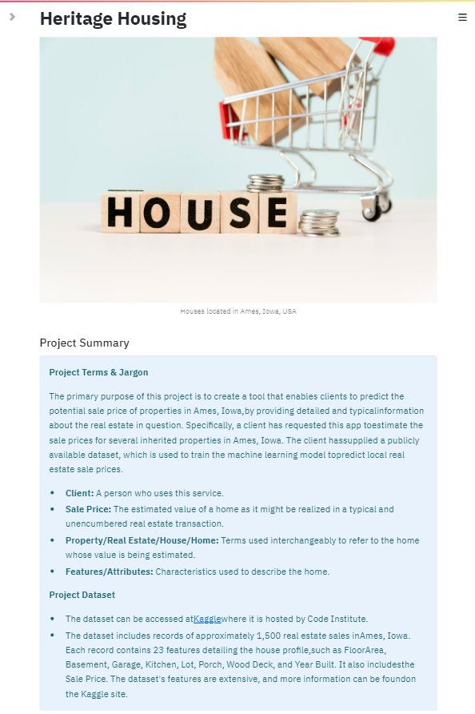
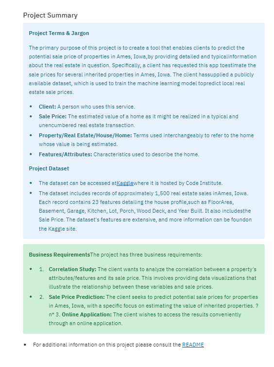
Quick Project Summary:

Overview of the project's objectives and key outcomes.
Project Terms & Jargon:

Explanation of important terms and jargon used throughout the project.
Describe Project Dataset:

Description of the dataset, including the number of rows and columns, and the types of features included.
State Business Requirements:

Clear statement of the business requirements that the project aims to address.
#### Page 2: House Sale Price Study

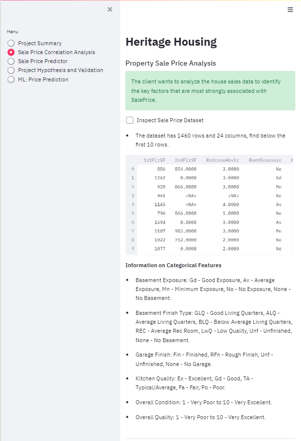
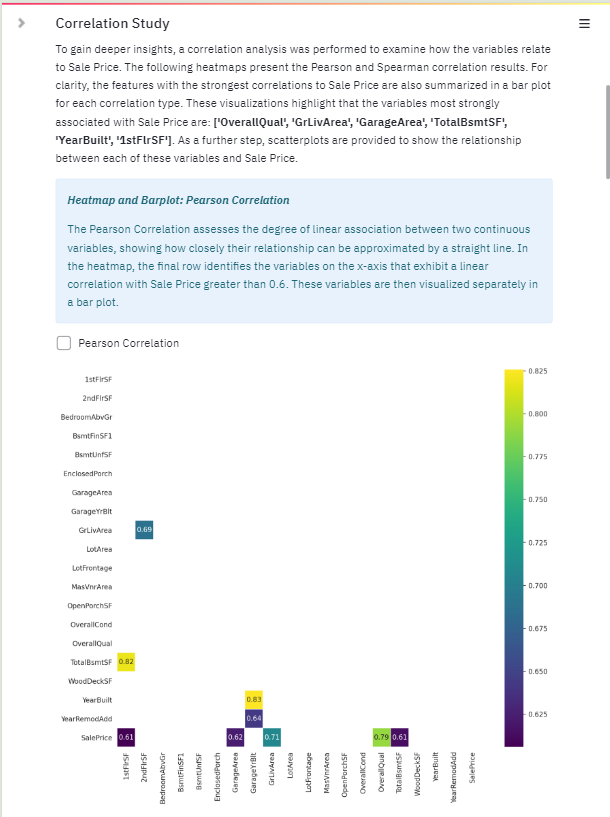
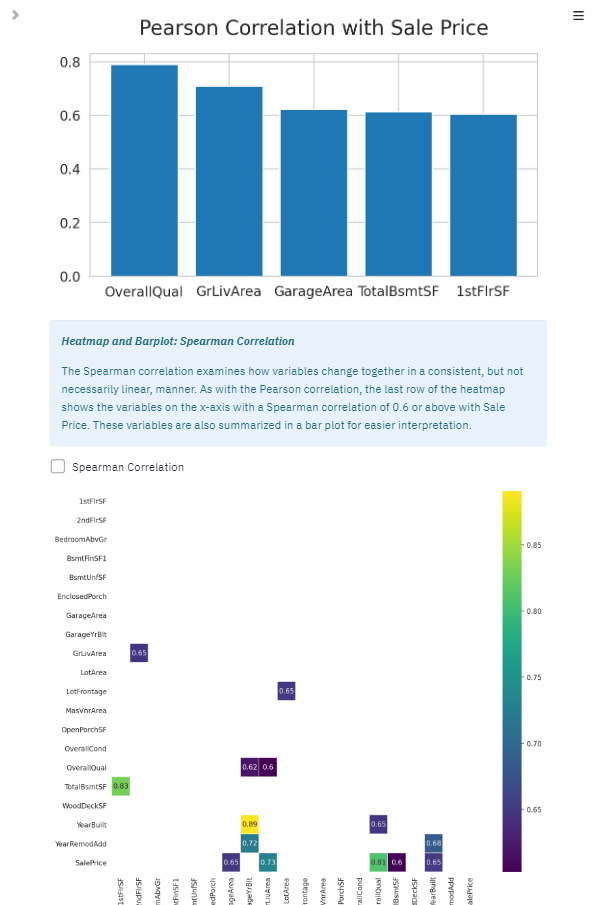
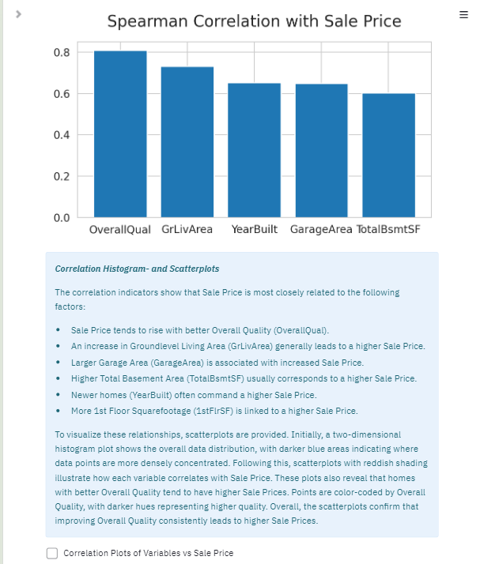
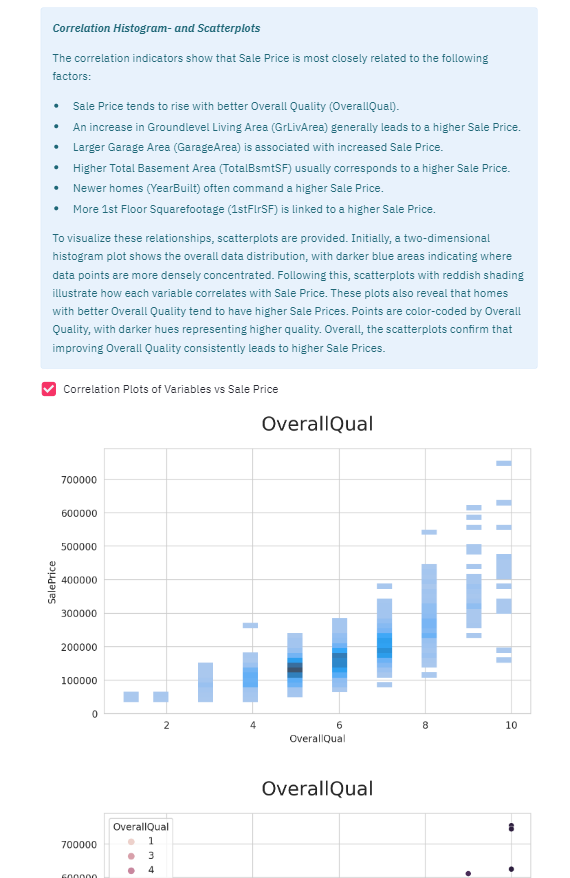
Purpose:

To address Business Requirement 1 through data visualization and analysis.
Content:

State Business Requirement 1: Clearly define the first business requirement.
Checkbox: Data Inspection:
Display the number of rows and columns in the dataset.
Show the first ten rows of the dataset for initial inspection.
Display Correlated Variables:
Present the most correlated variables to house prices and summarize the conclusions.
Checkbox: Individual Plots:
Show plots illustrating house price levels for each correlated variable.
Checkbox: Plot with OverallQuality Hue:
Display a plot showing house prices and correlated variables, colored by Overall Quality.
#### Page 3: House Value Estimator

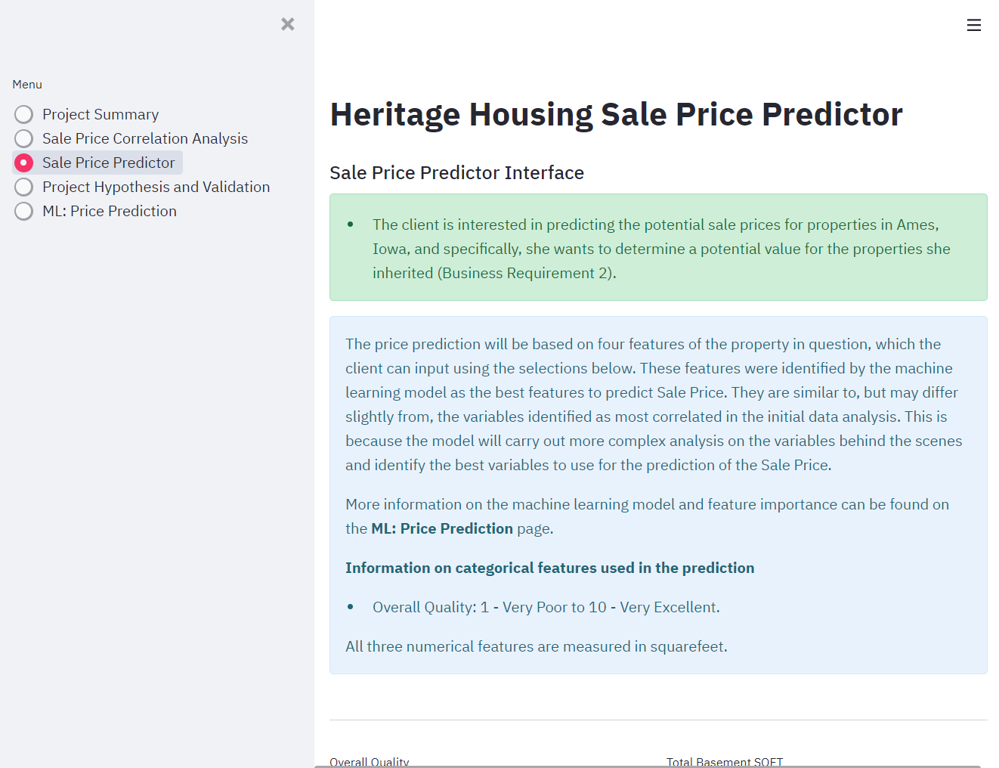
Purpose:

To address Business Requirement 2 by providing a tool for predicting house sale prices.
Content:

State Business Requirement 2: Clearly define the second business requirement.
Widgets for User Input:
Provide input fields for various house variables related to the prediction task.
Run Predictive Analysis Button:
A button that triggers the ML pipelines to predict the house's sale price based on the input data.
#### Page 4: Project Hypothesis and Validation

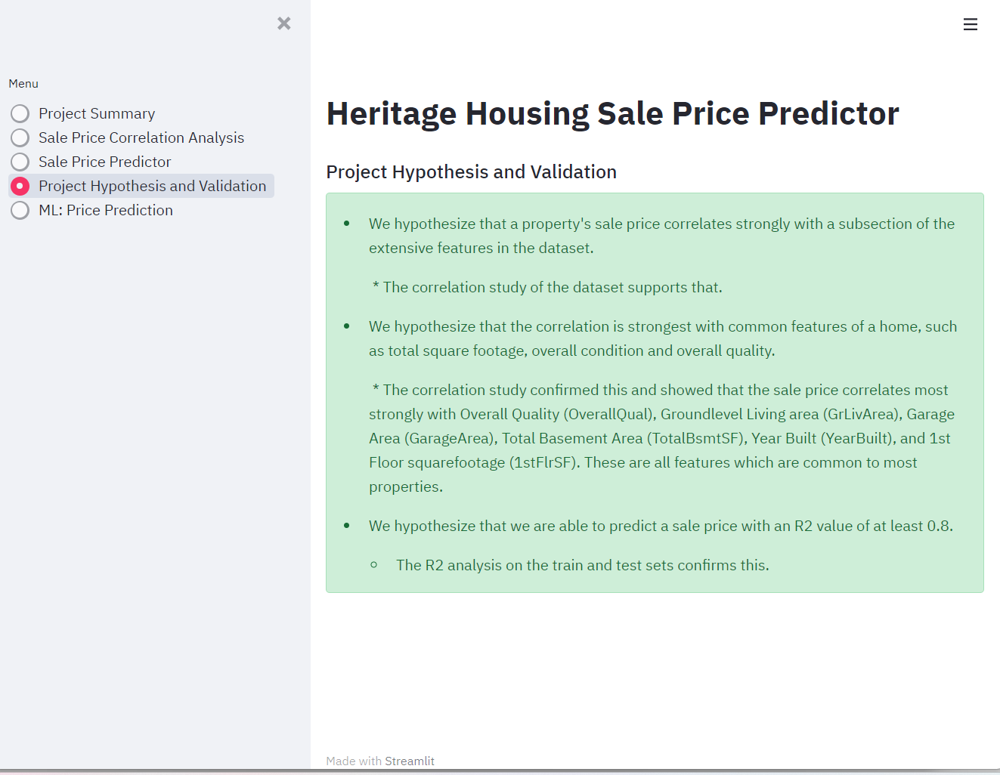
Purpose:

To describe and validate each hypothesis formulated during the project.
Content:

Hypothesis 1:
Larger square footage correlates with higher sales price.
Validation: Strong correlation confirmed by the correlation study.
Hypothesis 2:
More recent Year Built dates correlate with higher sales prices among houses with similar square footage.
Validation: Moderate correlation confirmed, with recent builds typically having higher Overall Quality.
Hypothesis 3:
More recent Remodel dates correlate with higher sales prices among houses with similar square footage and Year Built dates.
Validation: Weak to moderate correlation confirmed, noting the relationship with higher Overall Quality.
Hypothesis 4:
Higher quality and condition scores correlate with higher sales prices among houses with similar square footage.
Validation: Strong correlation confirmed by the correlation study.

#### Page 5: ML: Predict House Value

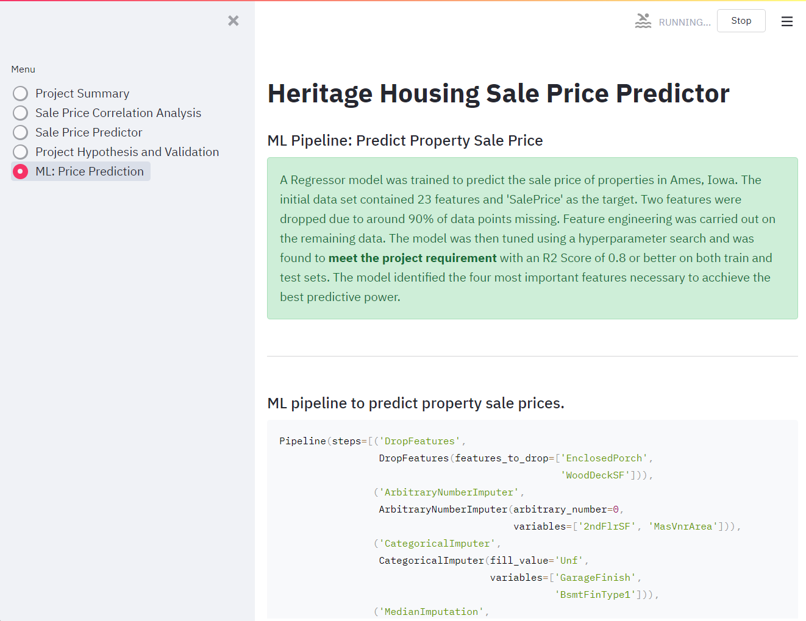
Purpose:

To present the considerations and conclusions after training the ML pipeline.
Content:

Considerations and Conclusions:
Insights and lessons learned from the ML pipeline training process.
ML Pipeline Steps:
Detailed presentation of the steps involved in the ML pipeline.
Feature Importance:
Analysis and visualization of the importance of different features in the prediction model.
Pipeline Performance:
Evaluation of the pipeline's performance, including metrics and validation results.

## Deployment

### Heroku

* The App live link is: [Live Project](https://predictive-analytics-69424e907041.herokuapp.com/)
* Set the runtime.txt Python version to a [Heroku-20](https://devcenter.heroku.com/articles/python-support#supported-runtimes) stack currently supported version.
* The project was deployed to Heroku using the following steps.

1. Log in to Heroku and create an App
2. At the Deploy tab, select GitHub as the deployment method.
3. Select your repository name and click Search. Once it is found, click Connect.
4. Select the branch you want to deploy, then click Deploy Branch.
5. The deployment process should happen smoothly if all deployment files are fully functional. Click the button Open App on the top of the page to access your App.
6. If the slug size is too large then add large files not required for the app to the .slugignore file.

## Main Data Analysis and Machine Learning Libraries

### Libraries Used In The Project:

- Numpy: Utilized for processing arrays that store values and data.

- Pandas: Employed for data analysis, data exploration, data manipulation, and data visualization.

- Matplotlib: Used for generating graphs and plots to visualize the data.

- Seaborn: Utilized to visualize the data in the Streamlit app with graphs and plots.

- ML: feature-engine: Applied for engineering the data for the pipeline.

- ML: Scikit-learn: Used to create the pipeline and apply algorithms, as well as feature engineering steps.

- Streamlit: Employed for building the web application.

## Credits

### Content

* The codes was taken from Walkthrough Project 02  Churnometer at Code Institute.

### Media

- Home Page image was used from [Freepik](https://www.freepik.com/search?format=search&last_filter=query&last_value=Heritage-Housing-project--Predictive-Analytics&query=Heritage-Housing-project--Predictive-Analytics)

